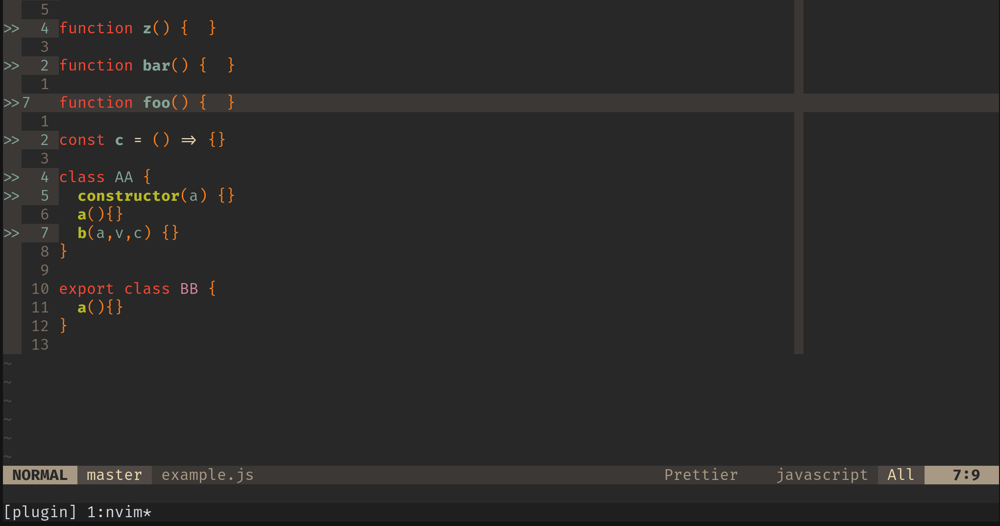

# Information

Neovim plugin that builds on top of treesitter to:
* Show all functions in the current buffer
* Open a fuzzy finder or any other selection tool to jump to that function line
  * Currently `FZF` or `Telescope`
  * Extension is easily doable (see further down)


# Disclaimer

The plugin is by far not done and not tested, I am just starting with lua, vimscript and treesitter, which is why it will break,
not work as expected or show wrong results.

Not all languages are tested (by far) and not all ways of declaring functions are implemented.
I mainly added ways that I most likely will face.

Fuzzy finders might break, depending on which ones (I mainly use `FZF` so `Telescope` might break from time to time).

The plugin should not be able to do destructive work, the only things that can happen is, that it shows wrong information or jump to wrong places.


# Usage

## Example




## Install

* Install this repo with your favourite plugin manager
  * Example vim-plug: `Plug 'eckon/treesitter-current-functions'`
* [Treesitter](https://github.com/nvim-treesitter/nvim-treesitter)
* Selection tool (only one is needed)
  * [fzf](https://github.com/junegunn/fzf.vim)
  * [telescope](https://github.com/nvim-telescope/telescope.nvim)

Either use the map or run the command
```vim
nmap <Leader>cf <Plug>TreesitterCurrentFunctions

nnoremap <Leader>cf <CMD>GetCurrentFunctions<CR>

:GetCurrentFunctions
```


## Usage for other tools

The internal treesitter plugin will return data about the current buffer file in format of a table.
There are two functions that can be called, one of them is probably only needed.

So how it works is: `User > Command > Selector (Fuzzy Finder) > Treesitter part`

The `Selector` can be exchanged (see [plugin folder](./plugin/treesitter-current-functions.vim)) by adding more edge cases to it.

The `Selector` internally calls the treesitter part, which is either
* `:lua require("treesitter-current-functions").get_current_functions()` or
* `:lua require("treesitter-current-functions").get_current_functions_formatted()`
both return the same information, but the formatted function already has the tables concatted into a table of strings

Implementation from vimscript can be found in the `FZF` implementation ([plugin folder](./plugin)) and an implementation from lua can be found in the `Telescope` implementation ([lua/selector folder](./lua/selector))


In general the functions can be called like following, and return:
* vimscript: `echo luaeval('require("treesitter-current-functions").get_current_functions()')`
  * `[[ "line_number", "function_name" ], ...]`
* lua: `require("treesitter-current-functions").get_current_functions()`
  * `{{ "line_number", "function_name" }, ...}`


# Development

For better debugging, uncomment the `package.loaded` part and comment out the `finish` in the plugin folder

Afterwards resourcing the files or init.vim (with the plug install) will make it easy to develop

Example:
* in init.vim: the plugin is installed via direct path
* then run `:so ~/.config/nvim/init.vim | GetCurrentFunctions`
