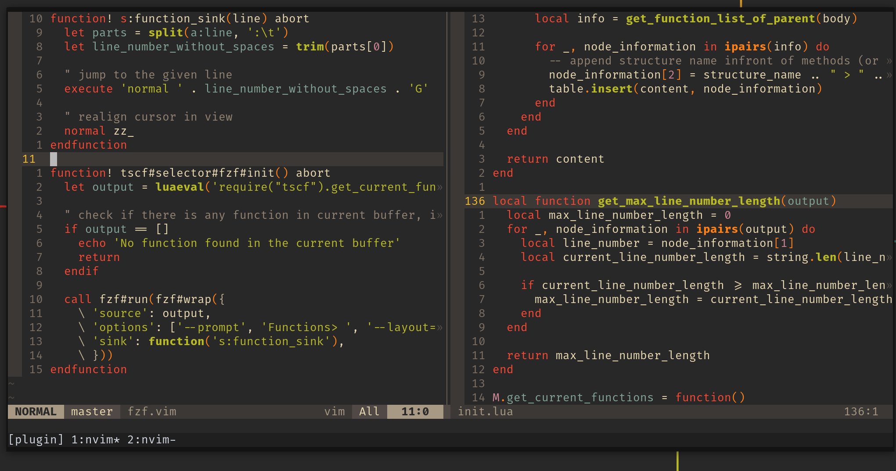

# Information

Neovim plugin that builds on top of treesitter to:
* Show all functions in the current buffer
* Open a fuzzy finder or any other selection tool to jump to that function line
  * Currently `FZF` or `Telescope`
  * Extension is easily doable ([see further down at development](#development))

Find more information with vim's internal help documentation
* `:help tscf`
* `:help treesitter-current-function`


# Disclaimer

The plugin is by far not done and not tested, I am just starting with lua, vimscript and treesitter, which is why it will break,
not work as expected or show wrong results.

Not all languages are tested (by far) and not all ways of declaring functions are implemented.
I mainly added ways that I most likely will face.

Fuzzy finders might break, depending on which ones (I mainly use `FZF` so `Telescope` might break from time to time).

The plugin should not be able to do destructive work, the only things that can happen is, that it shows wrong information or jump to wrong places.


# Usage

## Example

> Showcases fzf and telescope selector in vim, lua, php and js file



> Showcases older version, basic usage is the same (only fzf)


## Install

* Install this repo with your favourite plugin manager
  * `Plug 'eckon/treesitter-current-functions'`
* [Treesitter](https://github.com/nvim-treesitter/nvim-treesitter)
* Selection tool (only one is needed)
  * [fzf](https://github.com/junegunn/fzf.vim)
  * [telescope](https://github.com/nvim-telescope/telescope.nvim)

Quickly call the plugin, without any mappings:
```vim
:GetCurrentFunctions
```

The plugin does not add any mappings by itself.
As an example following map could be added to your `init.vim`:
```vim
nmap <Leader>cf <CMD>GetCurrentFunctions<CR>
```

For more information see
* `:help tscf-installation`
* `:help tscf-usage`


# Development

## Extending/Adding selector

The [internal treesitter plugin](./lua/tscf/init.lua) will return data about the current buffer file in format of a table.
There are two functions that can be called, one of them is probably only needed (formatted one).

So how it works is: `User > Command > Selector (Fuzzy Finder) > Treesitter part`

The `Selector` can be exchanged by adding more edgecases to the `Command` (see [main file in plugin folder](./plugin/tscf.vim)).

The `Selector` internally calls the treesitter part, which is either
* `:lua require("tscf").get_current_functions()` or
* `:lua require("tscf").get_current_functions_formatted()`
both return the same information, but the formatted function already has the tables concatted into a table of strings.

Examples can be found for vimscript and lua in the following parts:
* [FZF (vimscript - autoload/tscf/selector)](./autoload/tscf/selector/fzf.vim)
* [Telescope (lua - lua/tscf/selector)](./lua/tscf/selector/telescope.lua)

In general the functions can be called like following, and return:
* vimscript: `luaeval('require("tscf").get_current_functions()')`
  * `[[ "line_number", "function_name" ], ...]`
* lua: `require("tscf").get_current_functions()`
  * `{{ "line_number", "function_name" }, ...}`
* formatted call (`get_current_functions_formatted`)
  * same call as in vimscript and lua examples
  * `["line_number:\t function_name", "123:\t foo"]` or `{"line_number:\t function_name", "123:\t foo"}`


## Vim Help

* Add data to the help file (in doc)
* Run `:helptag doc/` to regenerate tags


## Debugging

For better debugging, uncomment the `package.loaded` part and comment out the `finish` in the plugin folder

Afterwards resourcing the files or init.vim (with the plug install) will make it easy to develop

Example:
* in init.vim: the plugin is installed via direct path
* then run `:so ~/.config/nvim/init.vim | GetCurrentFunctions`
